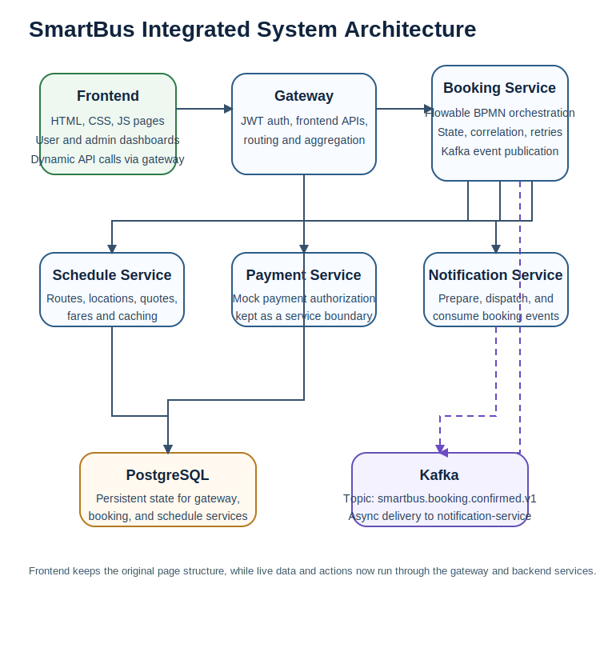
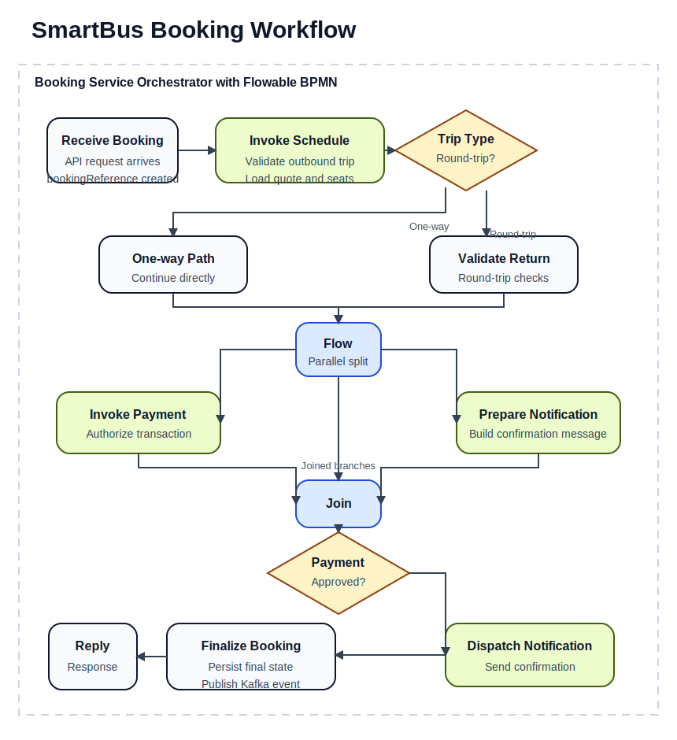
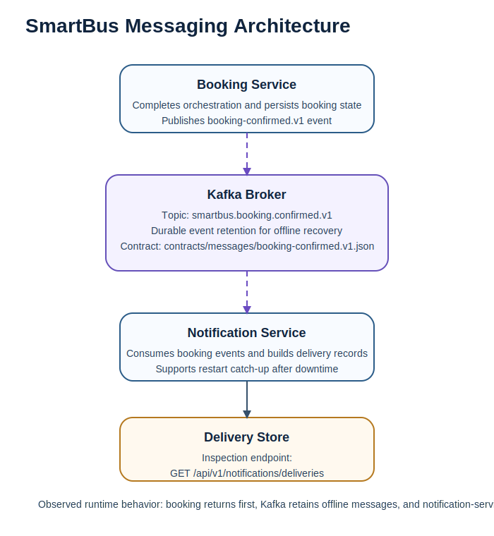

# SmartBus Integration Architecture

**Course submission scope:** Phase 2 integration architecture report  
**System:** SmartBus  
**Repository roots:** `frontend/`, `backend/`, `contracts/`, `docs/`, `infra/`, `orchestration/`

## 1. Original Website Overview

SmartBus started as a static frontend prototype located in `frontend/`. It contains multiple HTML entry pages, a shared stylesheet, and shared JavaScript. The project already presents the user flows needed for a bus ticketing system: public pages for route and fare browsing, login and registration pages, and user/admin dashboard pages. The frontend is served with webpack for local development.

The original limitation was that the website behaved like a demo rather than an integrated system. Trip data was hard-coded in `frontend/js/app.js`, and booking behavior was simulated in the browser with `localStorage`. There was no server-owned booking lifecycle, no cross-service messaging, and no durable operational state. In other words, the Phase I frontend gave SmartBus the user-experience shell of a ticketing application, but not the backend capabilities needed for a real working product.

That frontend has now been retained and integrated rather than replaced. Public route, schedule, and fare pages now load backend data through the gateway; the user booking flow now creates real backend bookings; and user dashboards now render persisted booking history from the booking service. Authentication remains lightweight and browser-session based for this assignment, and payment remains a mocked backend service, but the main app flow is no longer browser-only.

## 2. Updated System Architecture

SmartBus has now been expanded into a service-oriented backend rooted at the repository top level rather than inside `frontend/`. The backend uses Java 25, Spring Boot 4.0.3, PostgreSQL, and Kafka. The services are intentionally separated by business capability:

- `gateway` is the frontend-facing entry boundary and exposes frontend-oriented API composition endpoints.
- `booking-service` owns the ticket purchase lifecycle and orchestration.
- `schedule-service` owns route, fare, and quote reads.
- `payment-service` owns mocked payment authorization used by orchestration.
- `notification-service` owns customer confirmation preparation, dispatch, and delivery visibility.

Each service has its own PostgreSQL database boundary. Kafka is used only for asynchronous booking-confirmed events between booking and notification flows. The design keeps the booking service as the process coordinator, while partner services remain independently owned and replaceable.

The current architecture is therefore stronger than the original site in three ways. First, it moves state out of the browser and into durable backend services. Second, it separates the major responsibilities that were previously implicit in the frontend. Third, it now delivers a real integrated product shape: the existing HTML/CSS/JS frontend calls the gateway and backend services without redesigning the SmartBus pages from scratch.

## 3. Workflow and Orchestration

The core business flow is implemented as a custom orchestration in `booking-service`. The orchestration entrypoint is `POST /api/v1/bookings/orchestrated-bookings`. The process explicitly models the required orchestration concepts: `receive`, `invoke`, `flow`, `switch`, and `reply`.

The runtime sequence is:

1. Receive the booking request.
2. Call `schedule-service` to validate trip availability.
3. Branch for one-way versus round-trip logic.
4. Run payment authorization and notification preparation in parallel.
5. Dispatch the confirmation.
6. Publish a booking-confirmed Kafka event.
7. Reply to the caller with a confirmed booking response.

The orchestrated workflow is documented in `orchestration/booking-workflow.yaml`, `orchestration/runtime-config.yml`, and `docs/orchestration.md`. The implementation is in `backend/services/booking-service/src/main/java/com/smartbus/booking/BookingOrchestrationService.java`.

This design is appropriate for SmartBus because ticket purchase is inherently a multi-step integration process. A single service method would hide the integration points, but the explicit orchestration makes cross-service behavior, logging, retries, and state inspection visible.

## 4. Messaging Architecture

The platform uses Kafka for asynchronous communication after booking confirmation. Once the orchestration finishes successfully, `booking-service` publishes a `booking-confirmed.v1` event. `notification-service` consumes that event and records a delivery entry that can be queried later.

This introduces temporal decoupling. The booking flow can finish without blocking on an always-online downstream notification consumer. Kafka also gives SmartBus a simple recovery path: if the notification consumer is offline, the broker retains the message and the consumer can catch up on restart.

The event contract is versioned in `contracts/messages/booking-confirmed.v1.json`, and the behavior is documented in `docs/messaging-demo.md`. This message-driven edge is small by design, but it demonstrates a realistic enterprise integration pattern inside the SmartBus system.

## 5. Correlation Design

The system uses `bookingReference` as the business correlation key. It is generated once by the booking service and then reused across the booking response, persisted process state, workflow logs, partner service requests, and Kafka booking-confirmed events.

This is a strong choice because SmartBus needs one stable identifier that operators, clients, and logs can all use. Without it, retries, recovery, state lookup, and audit behavior would be much harder to reason about.

The persisted lifecycle states are:

- `RECEIVED`
- `SCHEDULE_VALIDATED`
- `ROUND_TRIP_VALIDATED`
- `PAYMENT_PENDING`
- `PAYMENT_AUTHORIZED`
- `NOTIFICATION_PENDING`
- `CONFIRMED`
- `FAILED`

The process state is stored in PostgreSQL and can be retrieved through `GET /api/v1/bookings/{bookingReference}/state`. The detailed rationale is captured in `docs/correlation-design.md`.

## 6. Caching Design and Performance

SmartBus uses two active cache levels in `schedule-service`.

- Data-level caching uses Spring Cache with Caffeine for route catalog and route definition lookups.
- Output caching uses an explicit in-memory response cache for repeated quote requests.

The data cache has a five-minute TTL and the output cache has a thirty-second TTL. Fare updates invalidate both cache layers through `POST /api/v1/schedules/admin/routes/{routeCode}/fare`. This is an appropriate trade-off because route and fare reads are much more frequent than administrative updates.

Measured test evidence from `ScheduleCachingTests` shows:

| Endpoint behavior | Cold read | Warm read |
|---|---:|---:|
| Route catalog | about 60-65 ms | under 1 ms |
| Quote response | about 62-65 ms | under 1 ms |

The cache design and measured evidence are documented in `docs/cache-strategy.md` and `docs/cache-performance.md`.

## 7. Service Contracts

Every exposed REST endpoint now has a versioned OpenAPI contract in `contracts/openapi/`. These contracts document the operations, schemas, examples, validation rules, status codes, and shared error responses.

The contract set includes:

- `gateway.v1.yaml`
- `booking-service.v1.yaml`
- `schedule-service.v1.yaml`
- `payment-service.v1.yaml`
- `notification-service.v1.yaml`

This is important because SmartBus now includes a real frontend-backend integration layer. The frontend pages call gateway-backed APIs for routes, quotes, bookings, and admin fare updates, so machine-readable contracts are now part of the working application boundary rather than only future design preparation. OpenAPI also gives the project a real versioning policy and a predictable change boundary for future frontend changes.

Contract validation is automated through `sh contracts/validate-openapi.sh`, backed by `OpenApiContractValidationTests`. The operation inventory and ownership map are documented in `docs/service-catalog.md`.

## 8. Fault Handling Strategy

SmartBus now includes explicit resilience behavior in `booking-service` for distributed failures. Partner calls are executed through a dedicated `PartnerCallExecutor` with:

- configurable timeout threshold
- bounded retry attempts
- linear backoff
- structured logging with `bookingReference`
- consistent `503`, `504`, and `422` user-facing responses

Business rejections such as unavailable trips still return `422`. Transport and timeout failures return `503` or `504` after retries are exhausted. Failed bookings are persisted with lifecycle state `FAILED` so operators can still inspect the outcome by correlation key.

The fault-handling design is documented in `docs/fault-strategy.md`, and simulated evidence is recorded in `docs/fault-simulations.md`. The automated tests demonstrate transient retry recovery and timeout failure without crashing the orchestration runtime.

## 9. Scalability Analysis

The current SmartBus architecture is small but scales more cleanly than the original static site. Read-heavy route queries can scale independently through `schedule-service`, especially because the service already uses layered caching. The booking process remains the main integration hotspot, but it is isolated in one service and already uses explicit fault handling and correlation state.

There are still clear constraints:

- the caches are local to a single `schedule-service` instance
- notification delivery storage is still in-memory rather than durable
- the gateway currently provides light API composition rather than a full routing or BFF layer
- login and registration are still local-session flows rather than server-backed identity
- payment is still mocked for assignment scope rather than connected to a real processor

A reasonable scalability path would be:

1. move schedule output caching to a shared cache such as Redis if multi-node consistency becomes necessary  
2. persist notification deliveries in PostgreSQL  
3. strengthen gateway routing and frontend API composition  
4. replace local-session authentication with a real identity service  
5. add idempotency and compensation around payment-related retries

For the assignment scope, the current design is appropriately scaled: it demonstrates the right enterprise patterns without pretending that every production-hardening concern is already complete.

## 10. Integration Reflection

The SmartBus project now shows a clear before-and-after integration story. The original frontend gave a credible UI but no real server-backed behavior. The new backend introduces service boundaries, orchestration, asynchronous messaging, correlation, caching, versioned contracts, and fault handling. Those pieces are not only architectural groundwork anymore; they now support a working frontend/backend application path.

The frontend in `frontend/` was not discarded. It was integrated. The practical end-state now achieved in the repository is:

- the public route and schedule pages call gateway-backed schedule APIs
- the buy-ticket flow submits real booking requests
- user dashboard and ticket pages use persisted backend state rather than browser-only storage
- error states surface the new structured API errors
- admin fare updates call the backend and invalidate cache-backed reads
- payment stays intentionally mocked behind the backend service boundary

So the current repository should be understood as an integrated SmartBus application with some deliberate simplifications. The backend is no longer a placeholder, and the frontend is no longer only a static shell. The remaining work is production-hardening, not first-time integration.

## Implementation References

Key implementation artifacts referenced in this report:

- `frontend/js/app.js`
- `backend/gateway/src/main/java/com/smartbus/gateway/FrontendGatewayController.java`
- `backend/services/booking-service/src/main/java/com/smartbus/booking/BookingOrchestrationService.java`
- `backend/services/booking-service/src/main/java/com/smartbus/booking/BookingOrchestrationController.java`
- `backend/services/booking-service/src/main/java/com/smartbus/booking/PartnerCallExecutor.java`
- `backend/services/booking-service/src/main/java/com/smartbus/booking/JdbcBookingProcessRepository.java`
- `backend/services/schedule-service/src/main/java/com/smartbus/schedule/ScheduleCatalogService.java`
- `backend/services/schedule-service/src/main/java/com/smartbus/schedule/CachedQuoteResponseService.java`
- `contracts/openapi/*.yaml`
- `contracts/messages/booking-confirmed.v1.json`
- `docs/orchestration.md`
- `docs/messaging-demo.md`
- `docs/correlation-design.md`
- `docs/cache-strategy.md`
- `docs/cache-performance.md`
- `docs/fault-strategy.md`
- `docs/fault-simulations.md`
